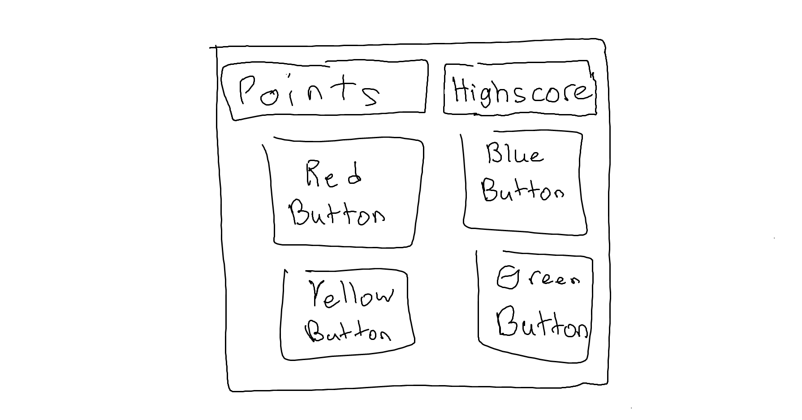

:warning: Everything between << >> needs to be replaced (remove << >> after replacing)

# Simon
## CS110 Final Project  Spring, 2024

## Team Members

Parker Schafer

***

## Project Description

Memorize the pattern of the buttons and repeat it. Every completion the pattern gets longer.

***    

## GUI Design

### Initial Design

### Final Design

## Program Design

### Features

1. Buttons to click
2. Start Menu
3. obstacle collisions  
4. game over screen
5. Points and Highscore tracker

### Classes

- Button:
    - initializes the 4 buttons and handles lighting them on/off 
  SimonScore:
    - handles current score tracking and writing/reading highscore file for tracking.
  Utility:
    - holds constants

## ATP

### Test 1: Verify the score tracker works
    Steps:
      1. Start the game
      2. Click play on the Start Menu
      3. Check total points tracker displays 0
      4. Play one sequence of simon by clicking on the buttons that lit up in order.
      5. Verify total points displays 1 for one sequence.
    **Expected Outcome**: The total points tracker should display 0 at the beginning and go up by one each sequence completed.
### Test 2: Verify highscore tracker works
    Steps:
      1. Start the game
      2. Click play on the Start Menu
      3. Check highscore displays current highscore contained in highscore.txt
      4. Play some sequences of simon.
      5. Verify highscore updates only when total points beats previous highscore
    **Expected Outcome**: The highscore tracker should display highscore.txt data and update if total points beats highscore.
### Test 3: Verify Simon sequence works
    Steps:
      1. Start game
      2. Click play on the Start Menu
      3. Buttons should light up and turn off in a sequence.
      4. Click buttons according to the sequence
      5. If clicked in correct order, it will move to a new sequence with one additional button and increase total points by 1.
      6. If clicked in incorrect order, it will display game over menu.
    **Expected Outcome**: Clicking buttons in the order that light up should increase points by 1 and increase the next sequence by one button.
### Test 4: Verify Start Menu works
    Steps:
      1. Start the game
      2. Start menu should pop up.
      3. Click Start.
      4. Verify Simon game shows up and begins the first sequence.
      6. Verify clicking Quit on start menu closes the pygame window.
      7. Verify choosing between Easy, Medium, and Hard changes the speed the sequence plays out.
    **Expected Outcome**: Clicking Start should start the simon game, clicking Quit should close the program, each difficulty should have different game speeds.
### Test 5: Verify Menu shows up at game over
    Steps:
      1. Start the game
      2. Click play on start menu
      3. Input the sequence wrong.
      4. Verify simon game ends and game start menu pops up with total points from that round.
      5. Verify clicking Quit end the program.
      6. Verify clicking Retry starts the simon game again.
    **Expected Outcome**: Losing a game shows the game over menu. Clicking Retry starts game again, clicking quit ends the program, total pointws displays correctly. 

