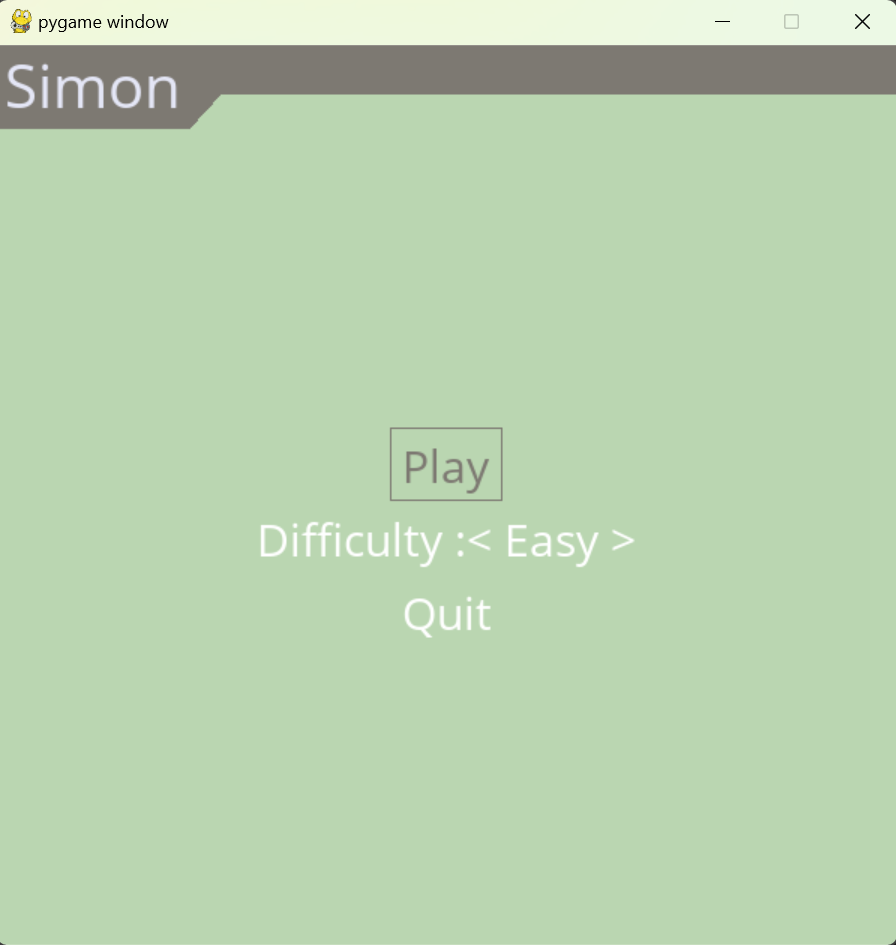

:warning: Everything between << >> needs to be replaced (remove << >> after replacing)

# Simon
## CS110 Final Project  Spring, 2024

## Team Members

Parker Schafer

***

## Project Description

Memorize the pattern of the buttons and repeat it. Every completion the pattern gets longer. You can change the speed of the pattern by choosing your difficulty on the start menu.

***    

## GUI Design

### Initial Design

### Final Design

## Program Design

### Additional Modules
  - Pygame-menu: https://pygame-menu.readthedocs.io/en/latest/#
   - Used for creating the start menu of the game.

### Features

1. Buttons to click
2. Start Menu
3. obstacle collisions  
4. game over screen
5. Points and Highscore tracker

### Classes

- Button:
    - initializes the 4 buttons and handles lighting them on/off 
- SimonScore:
  - handles current score tracking and writing/reading highscore file for tracking.

## ATP

### Test 1: Verify the total points tracker works
    Steps:
      - Start the game
      - Click play on the Start Menu
      - Check total points tracker displays 0
      - Play one round of simon by clicking on the buttons that lit up in order.
      - Verify total points displays 1 for one sequence.
     - **Expected Outcome**: The total points tracker should display 0 at the beginning and go up by one each round completed.
### Test 2: Verify highscore tracker works
    Steps:
      - Start the game
      - Click play on the Start Menu
      - Check highscore displays current highscore contained in highscore.txt
      - Play some rounds of simon.
      - Verify highscore updates only when total points beats previous highscore
     - **Expected Outcome**: The highscore tracker should display highscore.txt data and update if total points beats highscore.
### Test 3: Verify Simon sequence works
    Steps:
      - Start game
      - Click play on the Start Menu
      - Buttons should light up and turn off in a sequence.
      - Click buttons according to the sequence
      - If clicked in correct order, it will move to a new sequence with one additional button of random color added to the previous sequence and increase total points by 1.
      - If clicked in incorrect order, it will return to start menu.
     - **Expected Outcome**: Clicking buttons in the order that light up should increase points by 1 and increase the next sequence by one button.
### Test 4: Verify Start Menu works
    Steps:
      - Start the game
      - Start menu should pop up.
      - Click Start.
      - Verify Simon game shows up and begins the first sequence.
      - Verify clicking Quit on start menu closes the pygame window.
      - Verify choosing between Easy, Medium, and Hard changes the speed the sequence plays out. Easy is slower than Hard.
     - **Expected Outcome**: Clicking Start should start the simon game, clicking Quit should close the program, each difficulty should have different game speeds.
### Test 5: Verify Menu shows up at game over
    Steps:
      - Start the game
      - Click play on start menu
      - Input the sequence wrong.
      - Verify start menu pops up.
      - Verify clicking Quit ends the program.
      - Verify clicking Play starts the game again.
      - Verify choosing a different difficulty will change speeds like at the start.
     - **Expected Outcome**: Losing a game displays the start menu. All buttons should work like the start menu. Choosing a different difficulty from the previous should change speed. 

